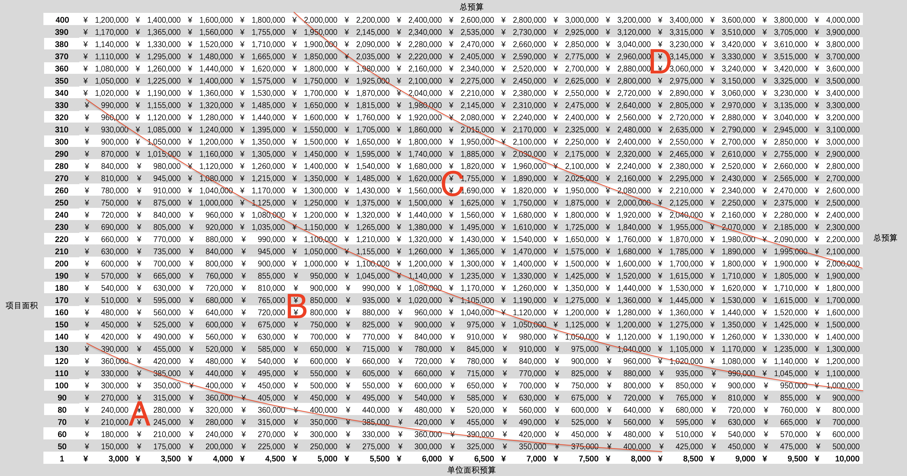
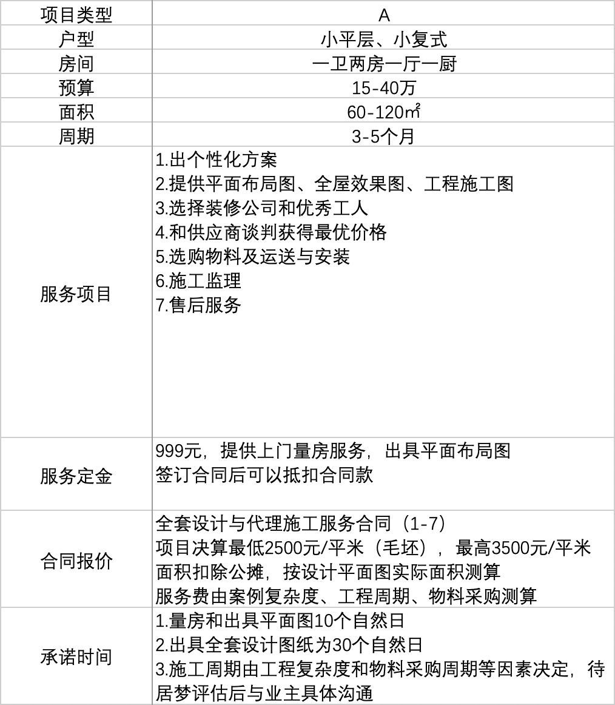
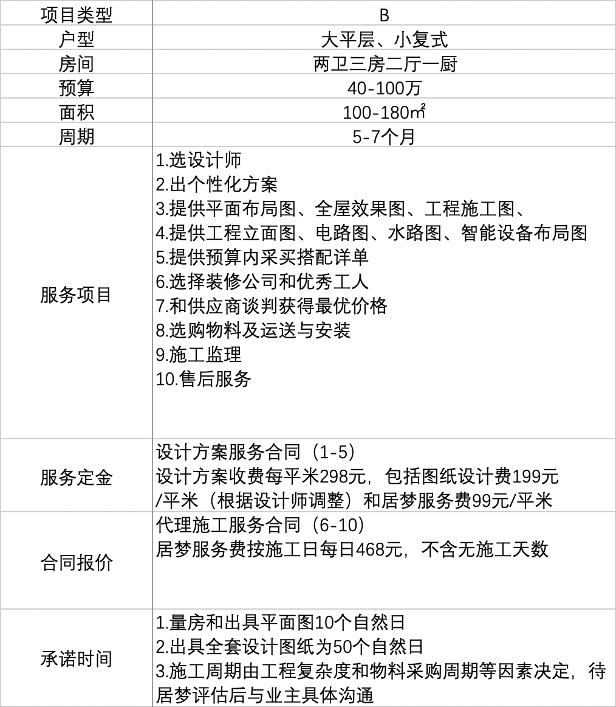
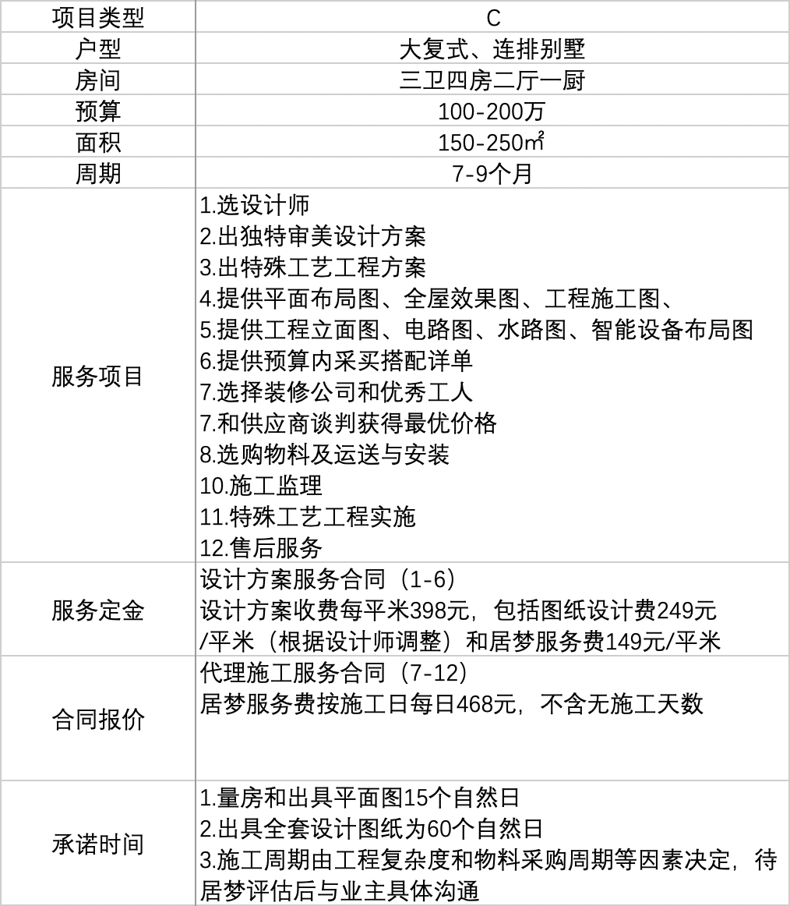
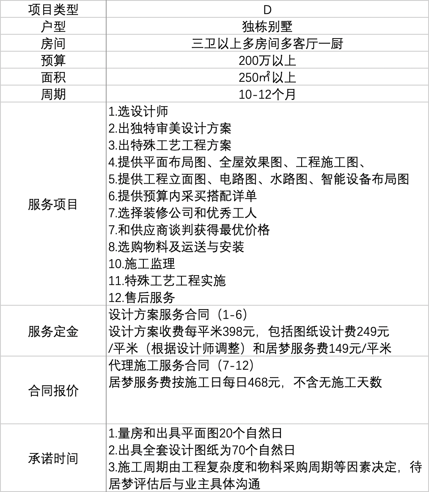
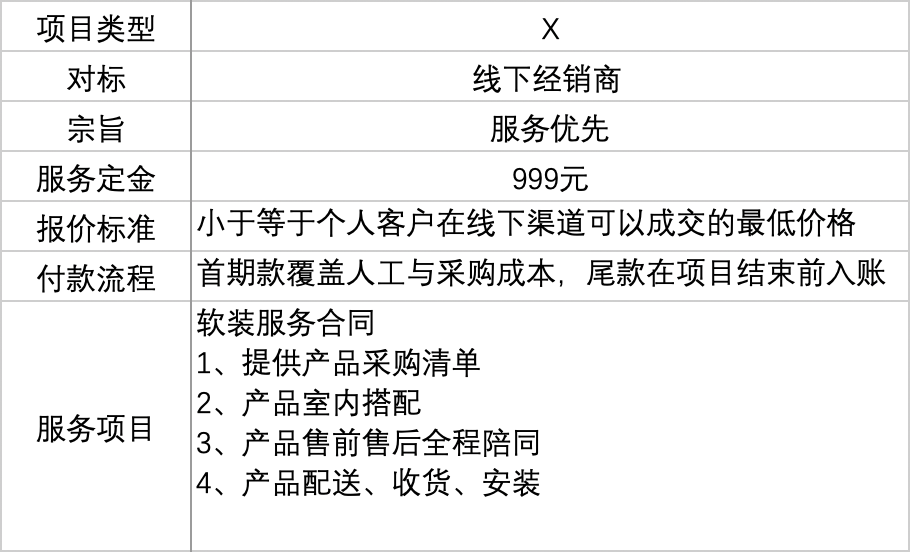
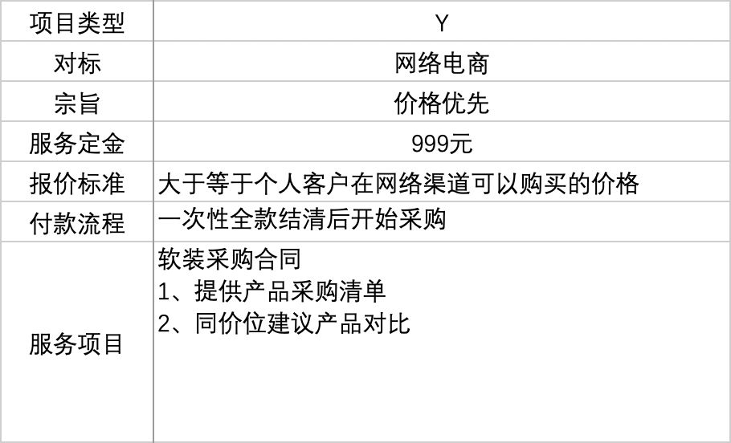

# 居梦科技项目管理手册

版本：v1 最后更新于：2019年11月27日 

居梦科技致力于打造一套可在多地协作的项目管理系统，让居梦项目团队能在工地现场内外有效地和设计师、施工师傅、材料供应商、产品经销商协作，让居梦业主客户及时准确地获取项目进度，确保多方信息流、资金流和物品流高效运转。

## 项目类型

### 管家代理一站家装服务

服务周期较长，综合预算较高。项目类型分为A、B、C、D四类，总结如下：

### A类

### B类

### C类

### D类

### 局部设计采购安装服务

服务周期较短，综合预算较低。项目类型分为X、Y两类，总结如下：

### X类

### Y类

## 项目立项

### 收取定金

1. 无论项目类型，原则上项目立项定金不少于**999元**。
2. 项目总监告知客户向**居梦企业支付宝**支付立项定金。
3. 财务确认收到项目立项定金后通知项目总监立项。

### 项目命名

项目总监给确定项目类型并为项目命名，这将是贯穿项目全周期的唯一指定名字。举例：A-中山海伦湾，A指项目类型，“-”后尽量简洁。在项目工作交流中，在不引起歧义的情况下，也可以使用项目名的部分进行交流。

### 启动管理

1. 立项定金入账后的8个自然日内，项目总监和项目助理应完成项目管理文件初始化信息输入，完成项目管理-v1审批。
2. 在项目进展过程中，项目助理每周完成项目管理版本更新，并在周四完成审批。
3. 项目助理每天在项目上投入超过半小时，需在每日汇报中提交项目进展汇报。

## 项目进展

### 设计阶段

### 采购阶段

### 施工阶段

### 交付阶段

### 维护阶段

## 项目管理

项目管理能力是我们商业模式成功与否的核心，也是居梦和传统家装企业最大的不同之一。我们希望设计出一套随着业务量增长，随着房屋所在地区范围扩大，随着内部人员扩编，随着外部产品服务供应方变多，可高扩展的内部项目管理系统。项目的黄金三角：质量、时间、成本，我们追求质量第一，时间可控，成本最优。项目管理按照质量、时间、成本优先级设计，分配管理资源。版本v1设计业务量为：同时在厦漳泉、珠三角两个区域开展10-20个A、B、C、D案例，30-50个X、Y案例，一位项目总监负责一个区域，每位总监带两位项目助理。供应商按照三级分类，数量在100-500个，产品与服务SKU，不超过1000个。

目前我们暂时使用一系列有逻辑关联的Excel工作表管理项目，这些工作表对分别对应项目管理不同部分的初始数据结构设计。在可见的未来，我们将把项目管理变成一个SAAS服务产品，对内保证跨地域跨项目协作，对外连接与项目相关的各个角色。具体每一个工作表的设计思路和用法见以下详细说明。

### 日历（项目共用）

这是全公司按照财年安排的共享日历表，所有项目共享此工作表的数据。对于我们来说，项目管理中的时间管理至关重要，因此这也是是甘特图日期和天数引用的来源。此表由公司系统自动生成，项目总监和经理不需要编辑此表。

### 供应（项目共用）

从财务角度来看，供应商的产品和服务构建了我们项目的成本，购买他们产品和服务的价格，与他们合作沟通的效率，直接决定我们每个项目的毛利率。同时，供应商提供的产品和服务的质量、品牌的影响力与售后服务，也决定着我们项目落地的效果和售前售后的服务投入。随着项目数量越来越多，我们能够积累大量供应商数据，这些信息应该共享给所有内部项目，从而不断提升我们与供应商打交道的能力，并且在项目实践中不断开发新供应商，迭代替换原有不合适的供应商。另外，随着我们项目数量增加，每个项目将会不可避免地留下盈余材料和产品。这些材料和产品可以进入内部仓库，后续出库供应给其他项目。

按照功能分类，有四类：设计、硬装、表面、软装。

按照来源分类，有两类：外部采购、内部库存。

#### 设计

在项目早期，设计是绝对的重头戏。优秀的设计不但能够提升项目的品味水准，超越业主期望，还能大大降低后续施工出错的概率，节省成本，缩短工期。可以毫不夸张地说，我们要把最多的时间和精力花在开工前的设计上。

- 室内设计师（室）
- 室内制图师（室）
- 效果图渲染（室）
- 魔术师（室）

#### 硬装

硬装包含物料和师傅两部分。通常情况下，我们替业主寻找到合适的装修公司或工程队，经业主授权，我们与之签署委托代理施工合同。一般而言涉及的物料有：

- 水电物料
- 泥水物料
- 木作物料
- 底漆物料

涉及的施工师傅有：

- 拆迁师傅
- 水电师傅
- 泥水师傅
- 木作师傅
- 涂装师傅
- 清洁师傅
- 魔术师傅

#### 表面

表面材料的选择往往决定一个项目的最终品味和预算。实践中不同类型的项目业主选择差别极大，如何选择合适的表面材料推荐给合适的业主很关键。表面细项包含：

- 墙布纸
- 木饰面
- 木地板
- 金属面
- 魔术面
- 涂料
- 地毯
- 瓷砖
- 石材
- 窗户
- 师傅

#### 软装
软装可选择的产品极为广泛，与我们合作的品牌供应商非常多。表面细项包含：

- 厨房柜体
- 厨房电器
- 厨房五金
- 卫浴柜体
- 卫浴电器
- 卫浴五金
- 卫浴洁具
- 客厅家具
- 卧室家具
- 其他家具
- 全屋灯具
- 全屋装饰
- 全屋智能
- 全屋门
- 大家电
- 小家电
- 小五金
- 师傅

## 项目总结
1. 向公司财务提交所有项目采购发票。
2. 清点项目使用材料和产品，输出最终

## 项目关闭

2. 